# BITS Pilani Student Fitness API

This project implements a Flask-based fitness and wellness API for a BITS Pilani student context, along with CI/CD automation using GitHub Actions and a Jenkins pipeline example.

## Project overview

The application exposes a minimal API that supports:
- checking the status of the service
- listing available fitness programs
- calculating estimated daily calories for a client
- generating a client summary for a chosen training plan

## Screenshot walkthrough

The screenshots are arranged by workflow step, not by the time they were captured. They show separate terminal and browser sessions, so use each image to understand the corresponding stage.

### 1. Get the project into GitHub

1. **Set up SSH access and clone the repository.** Register your public SSH key with GitHub, then clone the repository to the development machine.
   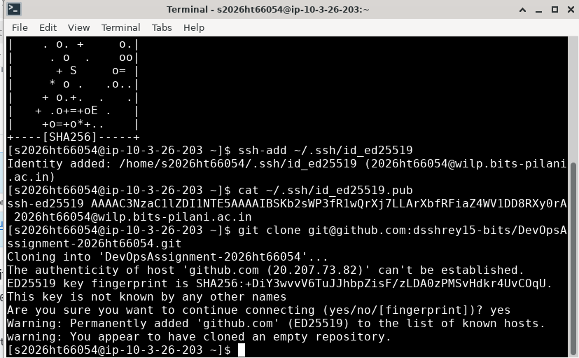

2. **Stage and commit the initial application.** Review the project files, stage the application, and create the initial commit.
   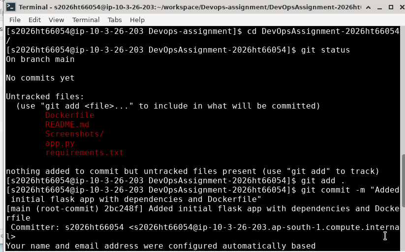

3. **Push the initial commit to GitHub.** Publish the project commit to the remote repository.
   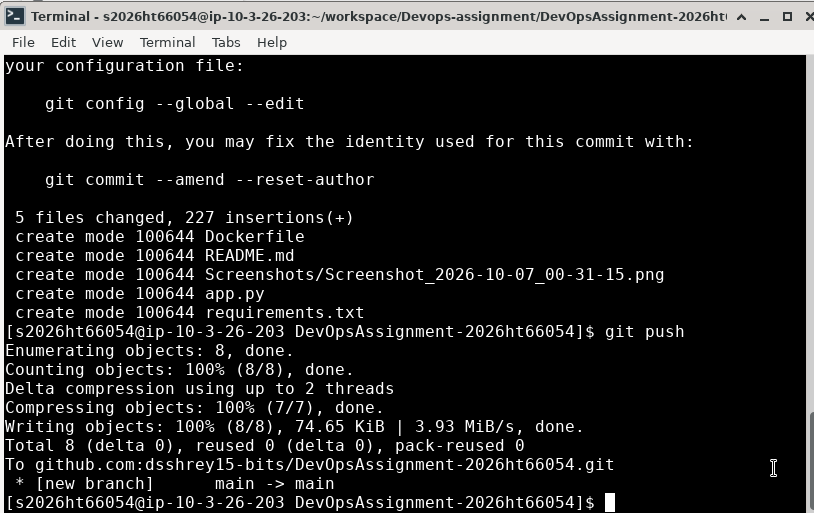

### 2. Prepare the test and CI/CD branches

4. **Create the test branch and test scaffold.** Add a feature branch for tests and create the initial test file under `tests`.
   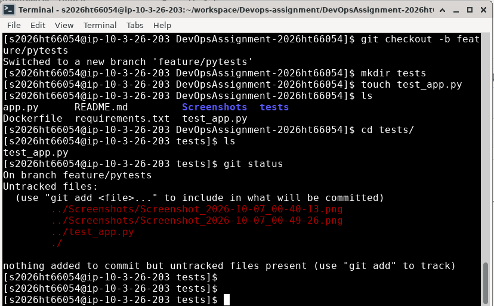

5. **Publish the test branch.** Set up its remote tracking branch so it can be shared.
   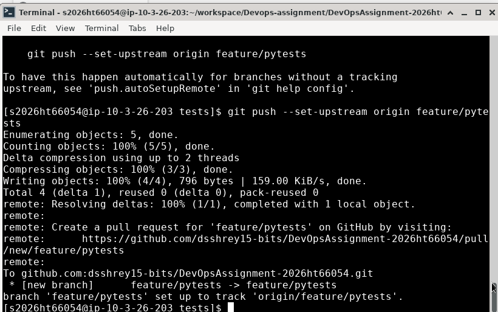

6. **Create the CI/CD branch and Jenkinsfile.** Switch to a separate branch for CI/CD work, then add and edit the Jenkins pipeline file.
   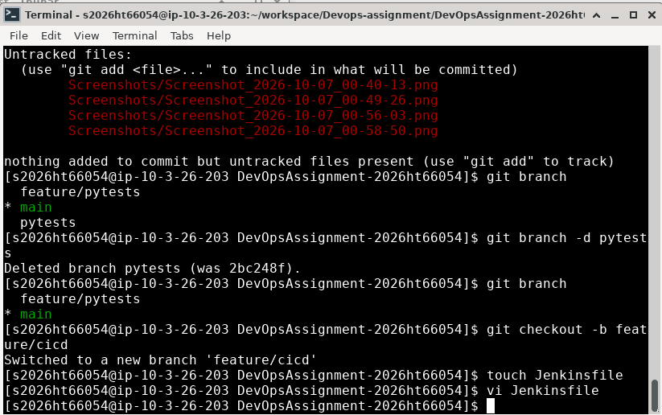

7. **Publish the Jenkinsfile update.** Merge the Jenkinsfile change into the main branch and push the update to the remote repository.
   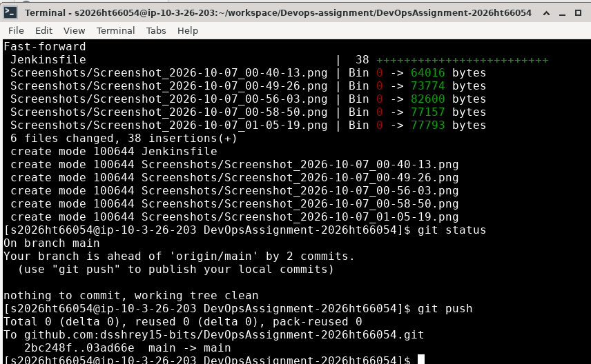

### 3. Build and check the Docker application

8. **Build the Docker image.** Build the application image from the project Dockerfile.
   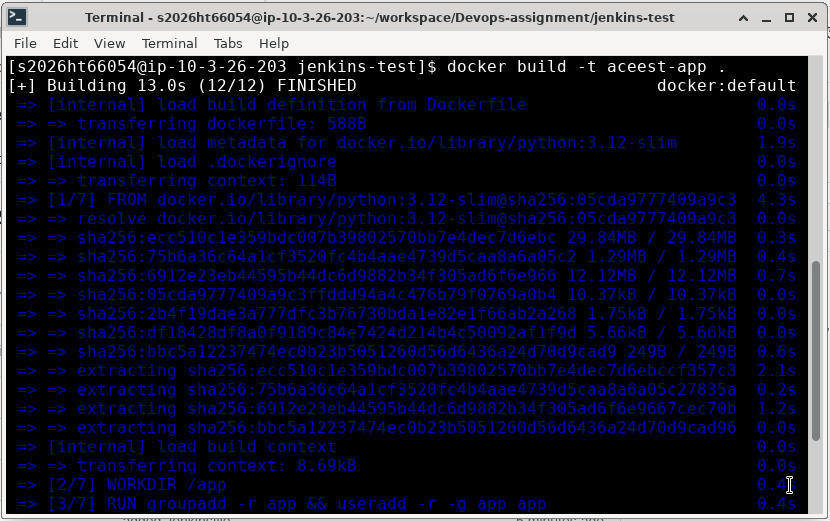

9. **Start the application container.** Run the built image with the application port exposed.
   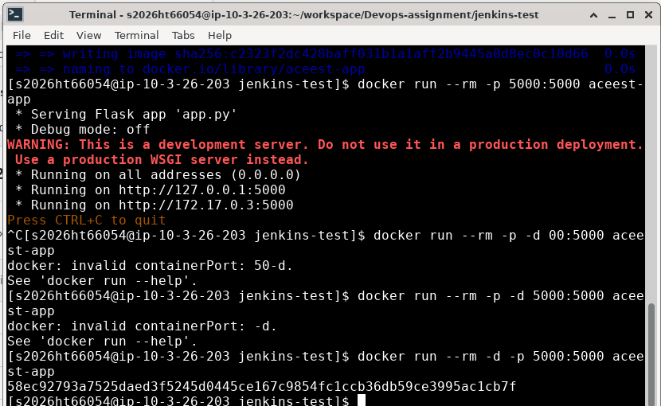

10. **Check the API response.** Confirm the running application returns the available fitness programs.
    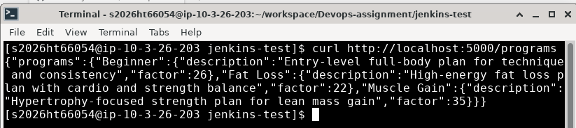

### 4. Configure and run Jenkins

11. **Create a GitHub personal access token.** Create a token for Jenkins and keep it secret; never commit or share it.
    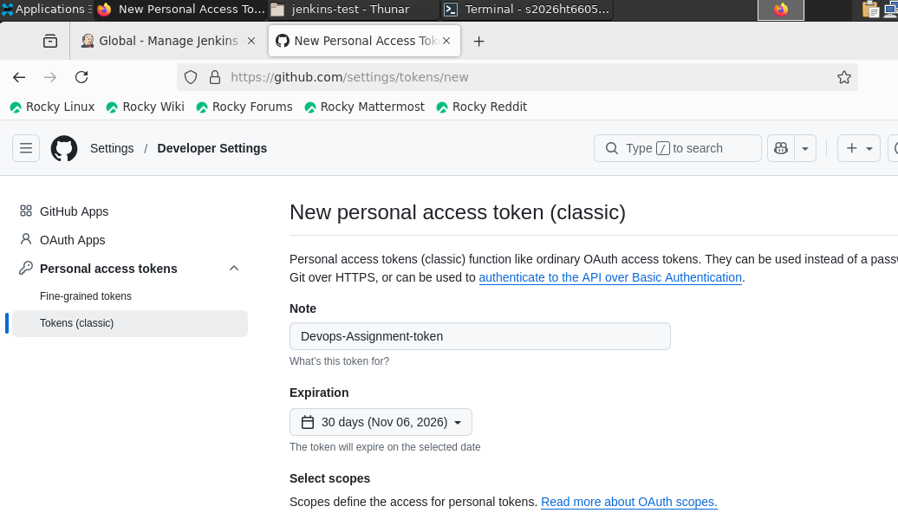

12. **Add the token as a Jenkins credential.** In **Manage Jenkins → Credentials → System → Global**, add the GitHub username and token as a credential.
    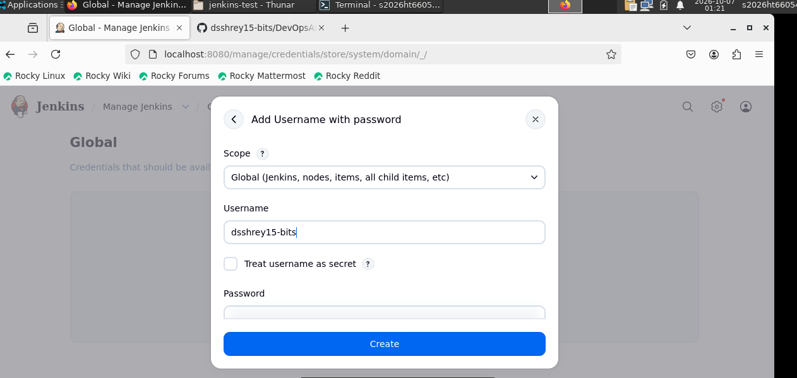
    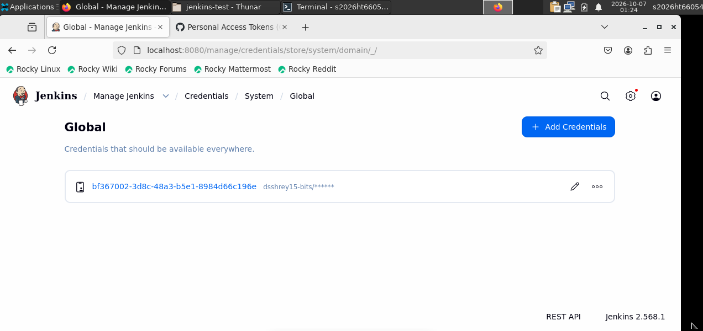

13. **Confirm the Jenkins credential is available.** Check that the credential is present in the Global credentials list.

14. **Create the Jenkins pipeline job.** Choose **New Item**, enter the job name, select **Pipeline**, and continue to its configuration.
    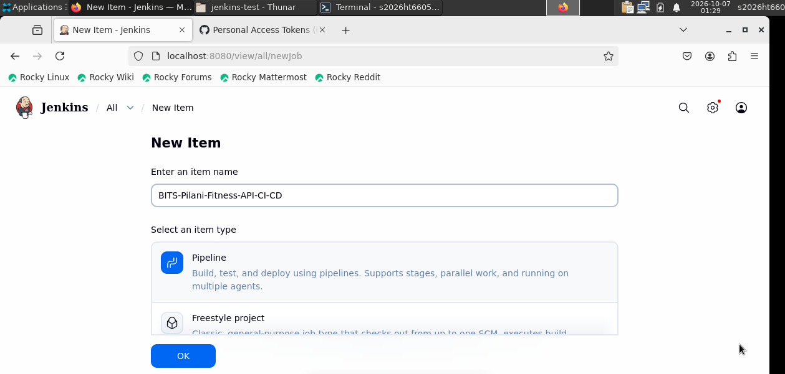

15. **Configure the pipeline repository.** Select the Git repository and saved Jenkins credential, then choose the `main` branch.
    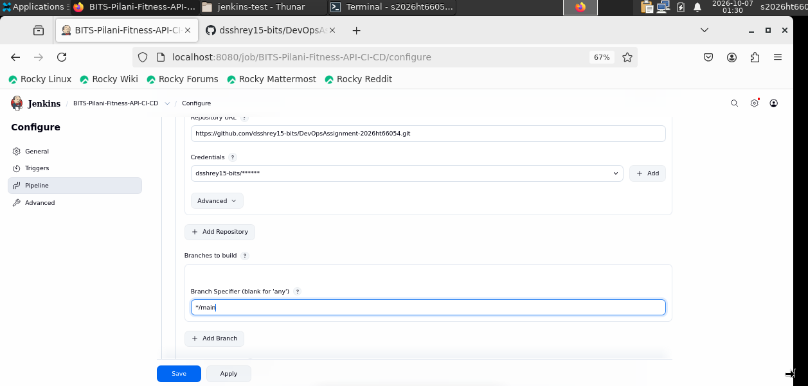

16. **Verify the Jenkins build.** The pipeline completes checkout, Python setup, tests, and the Docker image build successfully.
    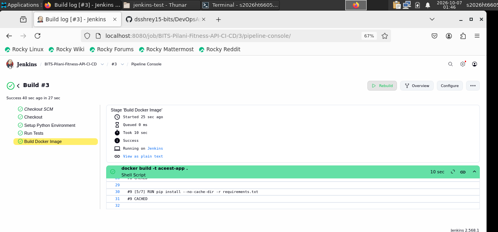

### 5. Add and verify GitHub Actions

17. **Add and publish the GitHub Actions workflow.** Commit the workflow on the CI/CD branch and push the branch to GitHub.
    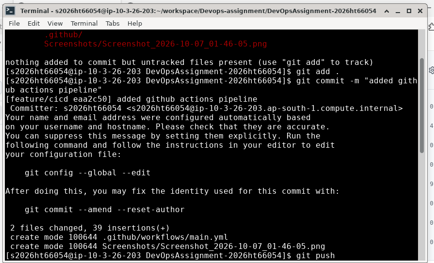

18. **Merge the CI/CD branch into `main`.** Publish the merged workflow and CI/CD changes to the main branch.
    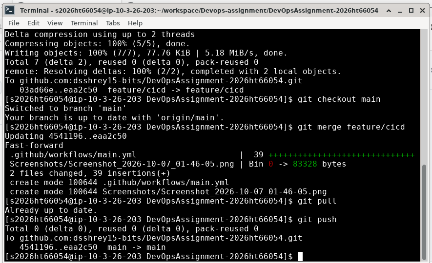

19. **Verify the GitHub Actions run.** Confirm the workflow's setup, dependency installation, syntax check, tests, and Docker image build completed successfully.
    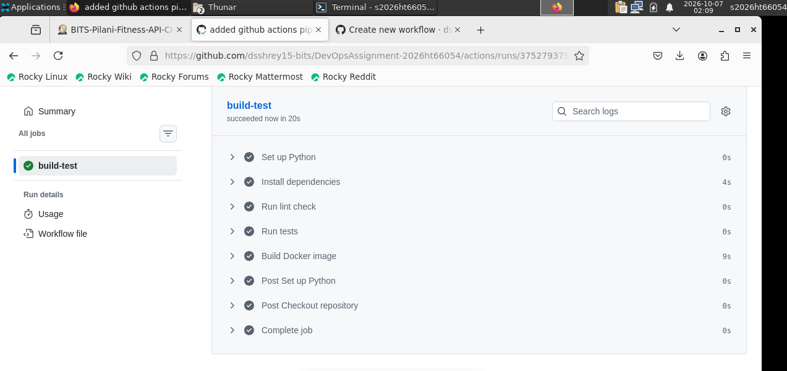

20. **Verify the pipeline after pulling the latest changes.** The latest GitHub Actions run completed successfully, including the API check in the `Test the build` step.
    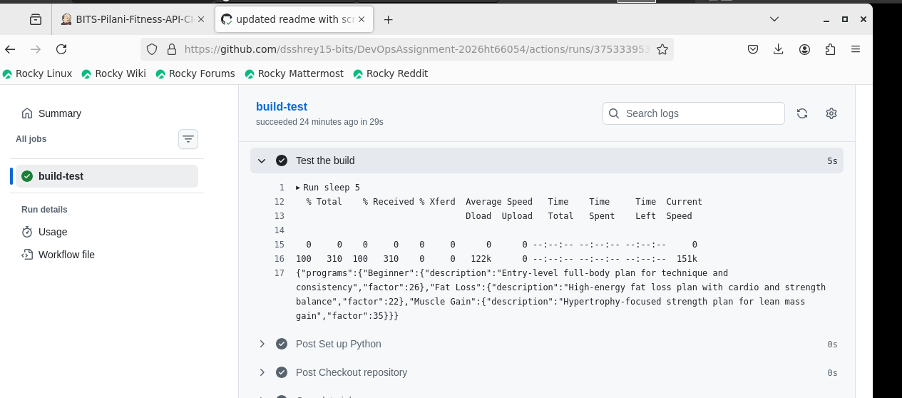

## Local setup

1. Clone or open the project folder.
2. Create a virtual environment:
   ```bash
   python -m venv .venv
   . .venv/bin/activate
   ```
3. Install dependencies:
   ```bash
   pip install -r requirements.txt
   ```
4. Run the Flask app:
   ```bash
   python app.py
   ```
5. Check the API health endpoint at:
   ```text
   http://localhost:5000/
   ```

## Manual testing

Run the test suite with:

```bash
pytest -q
```

## Docker

Build the Docker image:

```bash
docker build -t aceest-app .
```

Run the Docker container:

```bash
docker run -p 5000:5000 aceest-app
```

## GitHub Actions workflow

The GitHub Actions pipeline defined in `.github/workflows/main.yml` runs on every push and pull request. It performs the following steps:
- checks out the repository
- installs Python dependencies
- validates syntax using `compileall`
- runs the Pytest suite
- builds the Docker image

## Jenkins integration

The `Jenkinsfile` demonstrates how the build can be automated in Jenkins with the following stages:
- checkout source code
- install dependencies
- run tests
- build Docker image

This gives a second validation layer alongside GitHub Actions in a CI/CD environment.

## Key endpoints

- `GET /` - service health check
- `GET /programs` - available programs
- `POST /calculate-calories` - calculate calories
- `POST /client-summary` - generate a client summary

Example payload for calorie calculation:

```json
{
  "program": "Fat Loss",
  "weight_kg": 70
}
```

Example response:

```json
{
  "program": "Fat Loss",
  "weight_kg": 70,
  "calories_per_day": 1540
}
```
